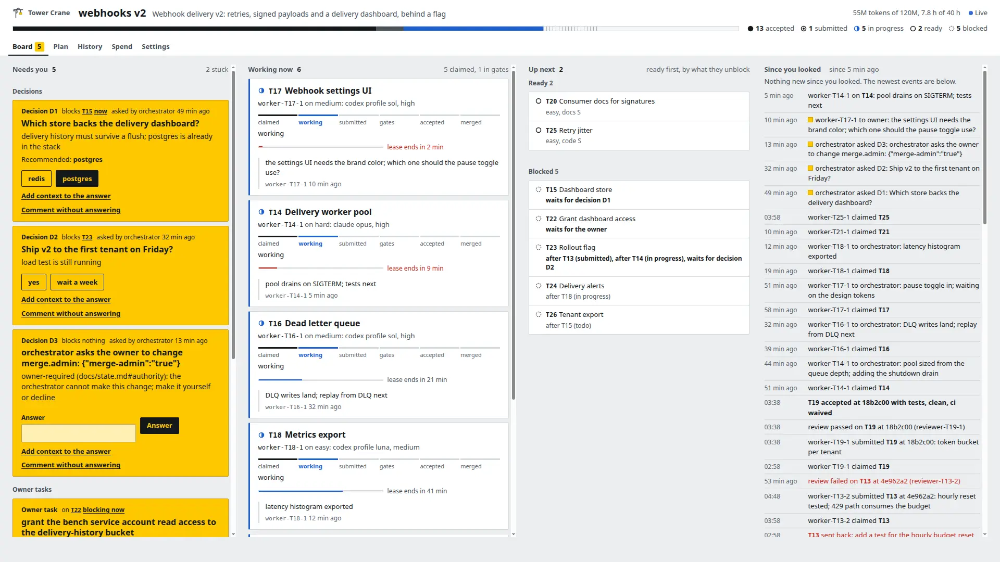
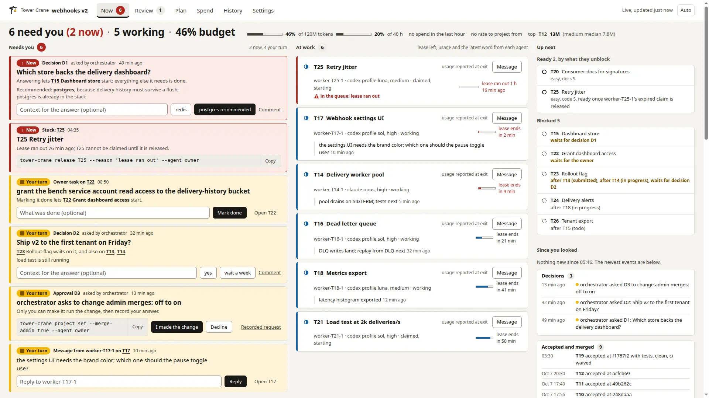
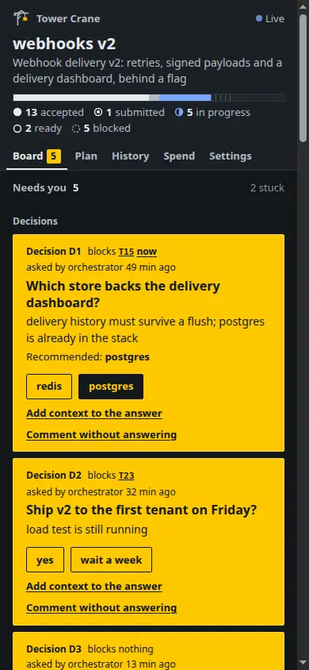
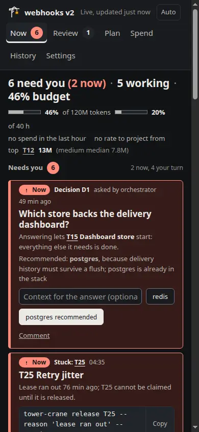

# The human bench

Tower Crane benches what agents do. This page benches what the owner does on the board: the jobs of [human-experience.md](human-experience.md) section 3, as the timed scenarios and checks of its section 6, run on the board before and after T79's redesign. The code is `test/bench/`; the results below are generated from its output by `test/bench/report.js`.

## Method

**Builds.** *Before* is the board T79 started from: `76d484d`, T93's live-spend head with main merged (T70's research included), extracted with `git archive`. *After* is this branch. Both serve the same fixtures; each build builds its own fixtures with its own CLI.

**Fixtures** (`test/bench/fixtures.js`). Scratch states built through the CLI only, never by writing JSON, so they stay valid as the state format changes. Commands run on a moved clock (`test/fixtures/hooks.js`), which gives events, leases and decisions the ages a real run has. No fixture touches a live state directory.

- *busy*: `webhooks v2`, 26 tasks. Twelve accepted tasks with recorded usage, shaped like T70's window W (the 90th percentile of tokens per task is about 5 times the median); two decisions, one blocking ready work; an owner-required `merge.admin` request the orchestrator made, which the engine turned into an approval; an owner task; five agents at work and one claim whose lease ran out; a submitted task whose review failed after one rework; an accepted task whose gates the owner waived; a message to the owner.
- *calm*: accepted history, two agents at work, nothing for the owner.
- *runaway*: the same history, then one easy task dispatched through `spawn` to T93's stub harness (`test/fixtures/live-usage-harness.js`), which writes 1M tokens a second to its own session file. Only the live collector puts spend into state. Variants: *stale* (the stub writes twice and the bench then stops the supervisor, so no new reading arrives while the agent runs) and *unavailable* (a command harness, which has no live usage).
- *budget*: the runaway history with a token budget sized so the project is at 92% once the stub has written its 2.4M tokens.

**Driver** (`test/bench/driver.js`). Headless Chrome from `test/browser.js`, with input through Chrome's own pipeline: `Input.dispatchMouseEvent` at the target's center and `Input.dispatchKeyEvent`, never page functions. A target outside the viewport is reached with the wheel over its scroll container, and the distance is recorded. Every input, the pointer travel, the target sizes and the wall time are recorded, and each scenario ends with a check of the state through the CLI files (`decisions.json`, `tasks.json`, `events.jsonl`). Page reads take their selectors and values as protocol arguments (`Runtime.callFunctionOn`), never as text spliced into page code. Screenshots are WebP. serve runs as the owner on the scratch states, with the same clean environment the board tests use.

**Timing.** Three numbers per scenario:

- the interaction count: clicks, keys and scrolls on the shortest path;
- the Keystroke-Level Model prediction, a floor for expert, error-free work, from Card, Moran and Newell's operators (s25 in [research/T70.json](../research/T70.json)): K 0.28 s ("average non-secretary typist"), P 1.1 s, B 0.1 s per press or release, H 0.4 s, M 1.35 s before each decision. A wheel notch counts as a K, with an M to find the place again after each scroll. Where a pass bar says "plus typing", it is held against the prediction without the typed characters;
- the owner's measured time, median of three cold runs. This bench is run by an agent, so that number is not in this report; it is the owner's run (see Limits).

**Checks** (`test/bench/checks.js`), from computed styles and Chrome's accessibility tree:

- *Contrast*: every visible text node against its effective background (ancestors' backgrounds blended), with the WCAG formula; 4.5:1, or 3:1 for 24 px or 18.66 px bold.
- *Color alone*: every status glyph has an accessible name or sits beside its status word.
- *Targets*: WCAG 2.5.8, 24 by 24 px or spaced so 24 px circles do not meet, inline links in a sentence exempt; buttons 32 px tall.
- *Names*: one `h1`, `main`, `nav` and a header, a polite live region, and no unnamed control in the accessibility tree.
- *Readability*: smallest text 12 px, at most six sizes, body text 15 px, a full line at most 80 characters (the text's own width against its line box), no clipped text, no sideways page scroll.
- *Motion*: running animations after load, with `prefers-reduced-motion: reduce`.
- *One room at a time*: for every room, by nav, direct link, a sheet opened inside it, a cleared fragment and a live update, exactly the routed room is displayed and its top is in the first viewport.
- *Density*: at 3840x1080, the share of a grid of points in the first viewport that lands on text, a control or a drawn item (not a band's own background).

## Results

<!-- results -->

| # | Scenario | Before | After |
|---|---|---|---|
| H1 | Find what needs me, 3840x1080 | 3/6 in view, title 5/6, KLM 7.59 s, fail | 6/6 in view, title 6/6, KLM 1.35 s, pass |
| H1 | Find what needs me, 1920x1080 | 3/6 in view, title 5/6, KLM 7.59 s, fail | 6/6 in view, title 6/6, KLM 1.35 s, pass |
| H1 | Find what needs me, 1280x800 | 1/6 in view, title 5/6, KLM 10.85 s, fail | 6/6 in view, title 6/6, KLM 1.35 s, pass |
| H1 | Find what needs me, 390x844 (count and first item) | 2/6 in view, title 5/6, KLM 1.35 s, fail | 1/6 in view, title 6/6, KLM 1.35 s, pass |
| H2 | Answer a decision with a note | 3 clicks, 0 scrolls, KLM 8.75 s without typing, focus after: BODY, fail | 2 clicks, 0 scrolls, KLM 6.1 s without typing, focus after: stuck-T25-lease, fail |
| H2a | Approve a change | sentence fail, raw JSON shown; apply: no path | sentence pass, raw JSON behind a disclosure; apply: no path (T89/T91) |
| H3 | Judge a review and send it back | 3 clicks, 3 scrolls, KLM 14.99 s without typing, 711 px scrolled, fail | 3 clicks, 0 scrolls, KLM 10.1 s without typing, 0 px scrolled, pass |
| H4 | Stop a runaway | spend rose before exit: yes; flagged: no; stop: no path, fail | spend rose before exit: yes; flagged: yes, 347 ms after the rule's threshold; stop: 2 clicks, KLM 5.3 s, stopped with no retry; recorded 10000000 of the stub's 10000000, pass |
| H4s | Lost telemetry: stale | state in words: no; drawn as zero: no; Now item: no; sentence says not counted: no, fail | state in words: yes; drawn as zero: no; Now item: yes; sentence says not counted: yes, pass |
| H4s | Lost telemetry: unavailable | state in words: no; drawn as zero: no; Now item: no; sentence says not counted: no, fail | state in words: yes; drawn as zero: no; Now item: no; sentence says not counted: yes, pass |
| H4p | Pause dispatch | no command on this base | no command on this base (T91), skipped |
| H5 | See spend, 1920x1080 | used shown, rate not shown, projection not shown, top not shown; freshness shown, fail | used shown, rate shown, projection shown, top shown; freshness shown, pass |
| H5 | See spend, 1280x800 | used shown, rate not shown, projection not shown, top not shown; freshness shown, fail | used shown, rate shown, projection shown, top shown; freshness shown, pass |
| H6 | Steer an agent | no path: no path: the board reaches the orchestrator only (task comment); msg --to the agent is CLI-only, fail | 3 clicks, 0 scrolls, KLM 7.4 s without typing, pass |
| H7 | Return after absence | named 7 of 7; grouped by meaning: no; heading contradicts: no, fail | named 7 of 7; grouped by meaning: yes; heading contradicts: no, pass |
| H8 | Calm run, light and dark | alarm or attention hue: 0/0; motion after load: 1/1 (breathe on conn); says nothing needs you: yes, fail | alarm or attention hue: 0/0; motion after load: 0/0; says nothing needs you: yes, pass |
| H9 | Mode parity (H2, H3, H6) | compared H2, H3; mismatches 0; H6 has no board path, pass | compared H2, H3, H6; mismatches 0, pass |

Checks on the front room with the busy run, per size and theme (failures of checked):

| Build | Size, theme | Contrast | Color alone | Targets | Names | Readability | Density |
|---|---|---|---|---|---|---|---|
| before | 3840x1080 light | 0 of 296 | 7 of 20 | 0 of 67, 0 short buttons | 0 unnamed, 1 h1 | 6 sizes (11, 12, 13, 14, 16, 20), min 11, 7% under 12 px, 0 clipped, 1 long lines | 63.9% |
| before | 3840x1080 dark | 0 of 296 | 7 of 20 | 0 of 67, 0 short buttons | 0 unnamed, 1 h1 | 6 sizes (11, 12, 13, 14, 16, 20), min 11, 7% under 12 px, 0 clipped, 1 long lines | 63.9% |
| before | 1920x1080 light | 0 of 250 | 7 of 20 | 0 of 60, 0 short buttons | 0 unnamed, 1 h1 | 6 sizes (11, 12, 13, 14, 16, 20), min 11, 5.5% under 12 px, 0 clipped, 0 long lines | - |
| before | 1920x1080 dark | 0 of 250 | 7 of 20 | 0 of 60, 0 short buttons | 0 unnamed, 1 h1 | 6 sizes (11, 12, 13, 14, 16, 20), min 11, 5.5% under 12 px, 0 clipped, 0 long lines | - |
| before | 1280x800 light | 0 of 197 | 7 of 20 | 3 of 43, 0 short buttons | 0 unnamed, 1 h1 | 6 sizes (11, 12, 13, 14, 16, 20), min 11, 5% under 12 px, 0 clipped, 0 long lines | - |
| before | 1280x800 dark | 0 of 197 | 7 of 20 | 3 of 43, 0 short buttons | 0 unnamed, 1 h1 | 6 sizes (11, 12, 13, 14, 16, 20), min 11, 5% under 12 px, 0 clipped, 0 long lines | - |
| before | 390x844 light | 0 of 58 | 7 of 20 | 0 of 20, 0 short buttons | 0 unnamed, 1 h1 | 6 sizes (11, 12, 13, 14, 16, 20), min 11, 0.8% under 12 px, 0 clipped, 0 long lines | - |
| before | 390x844 dark | 0 of 58 | 7 of 20 | 0 of 20, 0 short buttons | 0 unnamed, 1 h1 | 6 sizes (11, 12, 13, 14, 16, 20), min 11, 0.8% under 12 px, 0 clipped, 0 long lines | - |
| after | 3840x1080 light | 0 of 192 | 0 of 20 | 0 of 72, 0 short buttons | 0 unnamed, 1 h1 | 5 sizes (12, 13, 15, 17, 28), min 12, 0% under 12 px, 0 clipped, 0 long lines | 76.9% |
| after | 3840x1080 dark | 0 of 192 | 0 of 20 | 0 of 72, 0 short buttons | 0 unnamed, 1 h1 | 5 sizes (12, 13, 15, 17, 28), min 12, 0% under 12 px, 0 clipped, 0 long lines | 76.9% |
| after | 1920x1080 light | 0 of 192 | 0 of 20 | 0 of 72, 0 short buttons | 0 unnamed, 1 h1 | 5 sizes (12, 13, 15, 17, 28), min 12, 0% under 12 px, 0 clipped, 0 long lines | - |
| after | 1920x1080 dark | 0 of 192 | 0 of 20 | 0 of 72, 0 short buttons | 0 unnamed, 1 h1 | 5 sizes (12, 13, 15, 17, 28), min 12, 0% under 12 px, 0 clipped, 0 long lines | - |
| after | 1280x800 light | 0 of 117 | 0 of 20 | 0 of 45, 0 short buttons | 0 unnamed, 1 h1 | 5 sizes (12, 13, 15, 17, 28), min 12, 0% under 12 px, 0 clipped, 0 long lines | - |
| after | 1280x800 dark | 0 of 117 | 0 of 20 | 0 of 45, 0 short buttons | 0 unnamed, 1 h1 | 5 sizes (12, 13, 15, 17, 28), min 12, 0% under 12 px, 0 clipped, 0 long lines | - |
| after | 390x844 light | 0 of 54 | 0 of 20 | 0 of 20, 0 short buttons | 0 unnamed, 1 h1 | 5 sizes (12, 13, 15, 17, 21), min 12, 0% under 12 px, 0 clipped, 0 long lines | - |
| after | 390x844 dark | 0 of 54 | 0 of 20 | 0 of 20, 0 short buttons | 0 unnamed, 1 h1 | 5 sizes (12, 13, 15, 17, 21), min 12, 0% under 12 px, 0 clipped, 0 long lines | - |

The other rooms, at 1920x1080 in both themes, 1280x800 dark and 390x844 light (checks passed of run):

| Room | Before | After |
|---|---|---|
| Plan | 16 of 20 (fails: readability) | 20 of 20 |
| Spend | 16 of 20 (fails: readability) | 20 of 20 |
| History | 16 of 20 (fails: readability) | 20 of 20 |
| Task sheet | 3 of 5 (fails: color alone, readability) | 5 of 5 |
| Settings | 8 of 10 (fails: readability) | 10 of 10 |
| Review | no such room | 20 of 20 |

| Check | Before | After |
|---|---|---|
| Keyboard: H2 and H6 actions reached by Tab with a ring; Escape closes a sheet and returns focus | 1 of 2 (missing: form[data-api='/api/decisions/D1/answer'] input[name='note']); sheet ok, fail | 3 of 3 in 46 tabs; sheet ok, pass |
| One room at a time, 1920x1080: nav, direct link, sheet inside, cleared fragment, live update | 20 of 20, pass | 25 of 25, pass |
| One room at a time, 390x844: nav, direct link, sheet inside, cleared fragment, live update | 20 of 20, pass | 25 of 25, pass |
| Reduced motion: running animations after load | 0, pass | 0, pass |

Runs: before 2026-10-08 02:58Z on `before`, after 2026-10-08 03:07Z. Errors recorded: before 0, after 0.

<!-- /results -->

## What the numbers say

- **Find what needs me.** Before, the old board's needs column showed half of the six items in the first viewport at 1920 and 3840 and one at 1280x800, and its tab count left out the stuck claim. After, every item is in the first viewport at all three desktop sizes, the title carries the full count, and the prediction drops to one M. At mid widths a queue longer than three items takes the full width in two columns, ahead of the floor.
- **Decide.** The note field is beside the option buttons instead of behind a disclosure: two pointer actions instead of three, and focus lands on the next queue item. The prediction without typing is 6.1 s against the 6 s bar. That is the floor of the method itself (M P B B H, type, M H P B B): no layout makes it shorter, so the bar is out of reach for any mouse path with a note.
- **Judge a review.** The finding, the gate receipts and the send-back field are on one Review row: no scrolling, against 711 px and three scrolls before.
- **Stop a runaway.** Before, the live spend rose on the card but nothing flagged it and the board had no way to stop it. After, the spend rule (`lib/runaway.js`, the same flags `status` prints) puts it in the queue as a Now item well under a second after the live total crosses the rule, and Stop on its row ends it in two clicks, through the task budget the supervisor already enforces, with no retry. After exit the recorded spend matches the stub's own total. An earlier run on a T93 head before its retry and reconciliation fixes recorded one reading less (11M of 12M); on the current T93 base it matches.
- **Lost telemetry and spend.** A stale reading and an unavailable one are drawn in words, never as zero, and the status sentence counts the agents it cannot count. The bench found that an open page never aged a reading that stopped arriving, because nothing changed on disk; the page now ages live readings and asks for a fresh render once one passes its stale limit, which raises the Now item. Budget used, burn rate, projection and the top spender are on every page's spend line, with how fresh the live number is; before, only the used total was on the primary screen.
- **Steer.** The agent row's Message reaches the claimant through `msg`; before there was no board path to an agent.
- **Readability and calm.** Before, the front room used six sizes from 11 px, with 5 to 7% of its text under 12 px, and every other room failed a readability check. After, every room passes: five sizes from 12 px (12, 13, 15, 17 and 28, with 21 for room titles), body text 15 px, no line over 80 characters. Status glyphs that relied on color alone went from 7 of 20 to none. The calm run shows no alarm or attention hue and no motion; the old breathing dot is gone.

## Limits

- **Approvals and pause need T89 and T91.** On this base an escalation is answered after the owner makes the change at the terminal; T89's approval that applies the recorded request, and T91's `project set --paused` and `interrupt`, are not merged here. H2a's apply path and H4p are recorded as no path on both builds. Stop uses the task budget the supervisor enforces (`task update --budget-tokens`, operational), which stops the agent at its next reading and opens the owner's `budget.raise` decision; it becomes T91's `interrupt` when that lands.
- **T93 is stacked, not merged.** H4, H4s and H5 run against T93's real live collector on this branch, with its stub harness as the agent.
- **No measured human time.** The owner runs each scenario on the after build, cold, three times; the bench does not stand in for that.
- **No large-plan fixture.** The 200-task, 20,000-event fixture of the plan was not run: every CLI write re-renders the board under the lock, so building it through the CLI takes most of an hour. Plan rendering at that size is not measured here.
- **Machine load.** Both runs shared the machine with other sessions (load around 30). Wall times are not compared between builds; counts and predictions are.
- **Partial reruns.** Both builds ran in full after T79 merged its T93 base (T105's one-time link, T88's command argv rule). The after build's H4s then reran with `--only` once its command-harness fixture carried `{prompt}`, which that base requires. Each table row comes from the latest run of its step.
- **One fixture per scenario.** Each scenario ran once per build at the sizes shown. The deterministic bars are also assertions in `test/board.test.js` (contrast, targets, names and readability at the four sizes in both themes; one room at a time; the queue order; routing).

## Screenshots

The front room at every size and theme, each room at 1920x1080 in both themes and 390x844 light, a task sheet, Settings, and the end state of each scenario on the after build: [before/](human-bench/before/), [after/](human-bench/after/).

| Before, 1920x1080 light | After, 1920x1080 light |
|---|---|
|  |  |

| Before, 390x844 dark | After, 390x844 dark |
|---|---|
|  |  |

## Running it

```sh
git archive <before-commit> | tar -x -C ~/.cache/before
node test/bench/run.js --build before --tree ~/.cache/before --out ~/.cache/bench
node test/bench/run.js --build after --tree . --out ~/.cache/bench
node test/bench/report.js --results ~/.cache/bench --doc docs/human-bench.md --shots docs/human-bench
```

`--only H1,H4` reruns some steps and keeps the rest of an earlier results file. The scratch states go in a private directory made for the run and removed after it; `--scratch DIR` keeps them for inspection. Run it outside an agent task process; it needs Chrome. On a build that prints a one-time link, the driver opens it once per serve run, so the page holds the write token for the scenarios that write.
