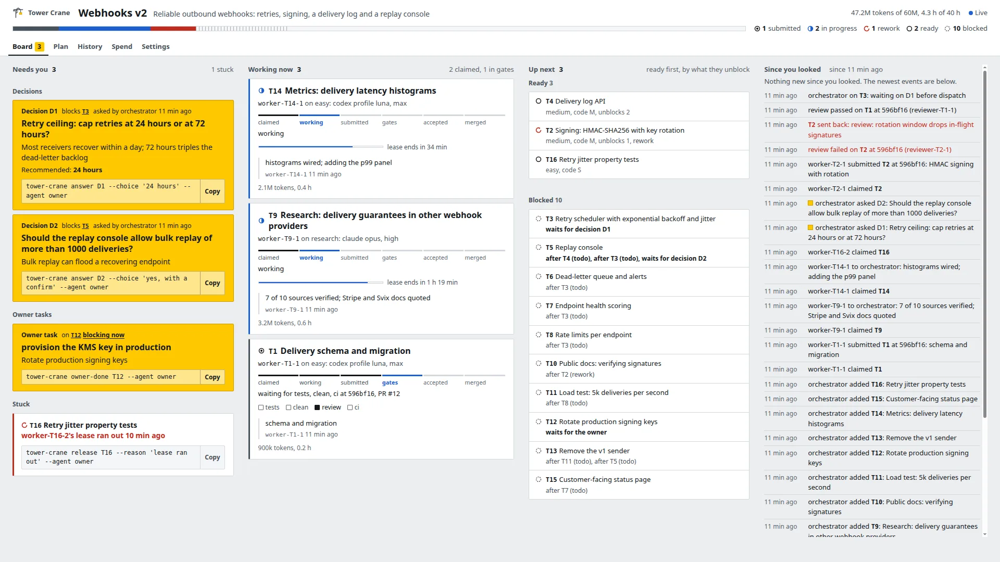
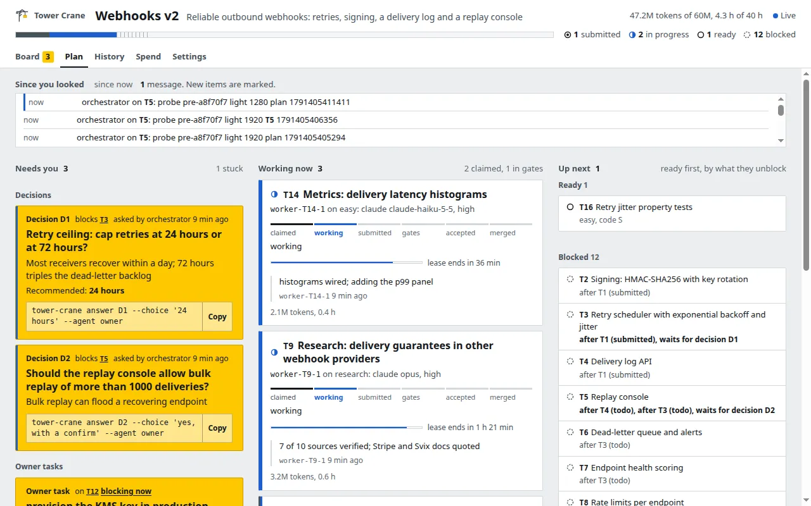
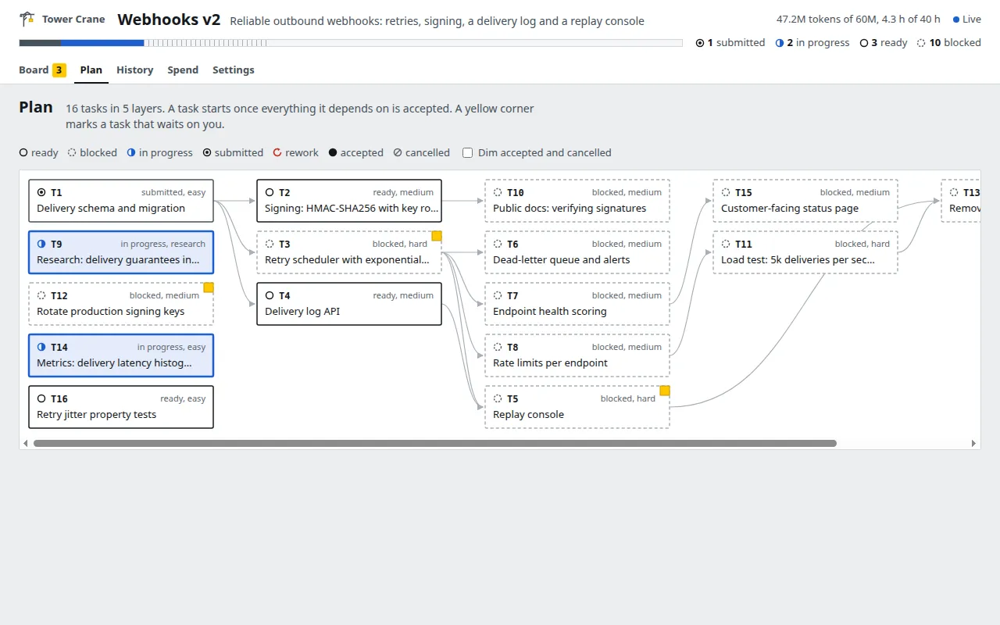
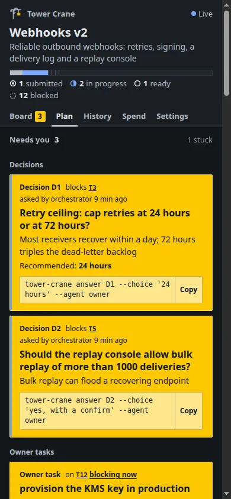
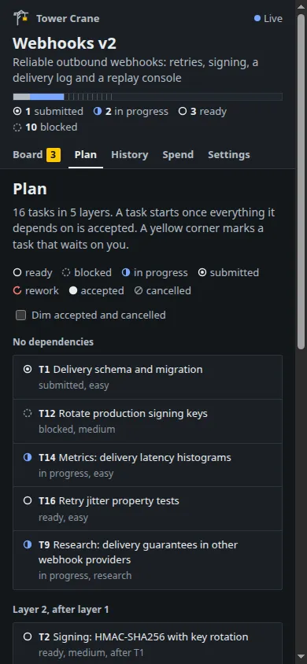

# The human side of Tower Crane

Tower Crane benches and gates everything an agent does. The person supervising the agents gets the board (`tower-crane serve`, `lib/board/`), and until now nothing measured whether the board serves that person. This document is phase 1 of T70: the research, a model of the owner's jobs in both control modes, an audit of today's board against that model, the design direction for a rebuilt board, and the plan for a human-side bench. Phase 2 is T79: it builds the redesign, runs the bench before and after, and gets the clean-context design review. When T79 lands, [design.md](design.md) is rewritten to match.

The owner's brief, 2026-10-07: the board "needs to be a house for the software", "delightful, compelling to look at, easy to understand, easy to act, easy to manage, trustable, arranged, clear, modern", and "like we bench and check anything on the agent side, we should create the same effort and experience for a human."

Citations such as [s1] refer to [research/T70.json](../research/T70.json), which `tower-crane check sources T70` verifies: every quote below is fetched from its page and matched. The list of sources is at the end.

## 1. Method

- **Research.** 26 public pages: Google SRE and PagerDuty on alerting and incident command, Google and Microsoft Research on code review, Fowler and GitHub on CI status, Nielsen Norman Group on status, dashboards, notifications and themes, WCAG 2.2, Weiser and Brown on calm technology, Google PAIR and Microsoft HAX on trust in AI, the human-factors literature on automation bias, irony of automation and alarm fatigue (through encyclopedia summaries, see Limits), the keystroke-level model, and the shipping agent dashboards of GitHub Copilot, Claude Code and Codex. Each claim in this document cites a quote.
- **This project's own run.** Every figure from this repository's live event log (read only) counts events by their `cmd` field over one window, called **window W** below: from the first event, 2026-10-06 14:06:50Z (`init`), to 2026-10-07 17:36:57Z, 27.5 hours and 10,090 events. The `type` field cannot be used: the 762 events written before it existed (the last at 2026-10-06 20:51Z) have none. In window W: 217 submissions (`submit`), 142 reworks (`rework`), 61 acceptances (`accept`), 49 merges (`merge`); 3 decisions (`ask`), answered after 58, 28 and 2 minutes (the third by the orchestrator under delegated technical decisions); 24 worker exits without submit (`worker-exited`); 1 stall (`stall`). 65 tasks have at least one `spend` event, 13 of them with minutes only and no tokens. Tokens per task over those 65: median 9.4M, 90th percentile 51.5M (linear interpolation), maximum 132.1M (T59). The 90th percentile is 5.5 times the median and the maximum 14 times. Almost half of all events (4,936) are `hook progress`. The owner ran `ladder set` 10 times and the orchestrator 28 times.
- **Control modes.** The task model and the direction follow the two control modes of T89 (PR #70) and T91 (PR #77), read from their contract docs (`docs/state.md` Authority and `docs/cli.md` at PR #77's head `a224069`) and their tests. Both PRs are submitted, not yet merged; the audit below is of the board on this branch, which does not have T91's Controls view yet.
- **Audit.** A scratch state (`webhooks v2`, 16 tasks: two open decisions, one owner task, three agents working, one submitted task with a review, one task sent back, and a claim whose lease ran out after burning 41M tokens on a size S task) is served by this branch's `tower-crane serve` and driven by headless Chrome through `test/browser.js`, the same DevTools driver the board tests use. Screenshots at the owner's four window sizes (3840x1080, 1920x1080, 1280x800, 390x844) in both themes are in [human-experience/before/](human-experience/before/). The two owner-reported bugs were probed on this branch and on the commits just before their fixes, with the same fixture, sizes and themes (4.1). The live state was never written; every probe used the scratch directory.

## 2. Findings

### 2.1 Attention and interruption

- An interruption must demand a person. Google SRE: "Every page should be actionable." [s1]. PagerDuty defines the term the same way: "An alert is something which requires a human to perform an action." [s4]
- Interruptions that are not rare stop being read: "When pages occur too frequently, employees second-guess, skim, or even ignore incoming alerts, sometimes even ignoring a "real" page that's masked by the noise." [s1] Medicine names the result alarm fatigue: workers "become desensitized to safety alerts, and as a result ignore or fail to respond appropriately to such warnings." [s19] and "such false alarms rob the critical alarms of the importance they deserve." [s19]
- The sustainable rate is low and measurable. SRE gives targets as "number of daily tickets < 5, paging events per shift < 2" [s2].
- Urgency comes in tiers with response windows. PagerDuty's medium tier "Requires human action within 24 hours." [s4]; Google's review guide puts the review ceiling at "One business day" [s6] and asks reviewers to respond between tasks: "If you are not in the middle of a focused task, you should do a code review shortly after it comes in." [s6]
- What is not urgent belongs on a surface the person visits, not in an interruption: "you should favor a dashboard that monitors all ongoing subcritical problems" [s1]. NN/g gives the same split for interfaces: "Action-required notifications are often urgent and should be intrusive" while "Passive notifications are typically not urgent and should be less intrusive." [s12]
- Calm technology describes the target state for a tab left open all day: it "engages both the center and the periphery of our attention, and in fact moves back and forth between the two." [s15], where the periphery is "what we are attuned to without attending to explicitly." [s15]
- Stress degrades the decisions an interruption asks for: "the more deliberate cognitive approach is typically subsumed by unreflective and unconsidered (but immediate) action" [s2]. A decision surface should lower stress: the question, the options and the consequence on one plate, no hunting.

**For Tower Crane.** In window W the owner received three decisions in 27.5 hours, well under the SRE ceiling, so decisions can afford to be prominent. The danger is the other direction: if the board promotes every lease warning, rework and gate failure to the same signal as a decision, the owner learns to ignore the signal. The board needs exactly three urgency tiers with distinct presentation, and the top tier must stay rare.

### 2.2 Trust calibration in automation

- The goal is calibrated trust, not more trust. Google PAIR: "Help users calibrate their trust." [s16] Trust "is slow, and it'll require proper calibration of the user's expectations and understanding of what the product can and can't do." [s16]
- Over-trust has two failure modes: "errors of omission and errors of commission" [s17], from "lack of monitoring of the automated system or blind agreement with an automation suggestion" [s17]. Under-trust follows signals that proved useless: a pilot "may be inclined to ignore future error recommendations conveyed by an engine gauge" [s17].
- Automating most of the work leaves the person the hard remainder. Bainbridge: "new, severe problems are caused by automating most of the work, while the human operator is responsible for tasks that can not be automated." [s18] and "Their work now also includes exhausting monitoring tasks." [s18]
- When automation is wrong, correction must be cheap: "Make it easy to edit, refine, or recover when the AI system is wrong." [s20]

**For Tower Crane.** The gates are the automation the owner must calibrate against. In window W there were 142 reworks against 217 submissions, so gates and reviews catch a lot; the owner cannot see that from the board. A gate pass should read as a receipt (what ran, at which commit, what it proved), never as a green light, and the board should show each gate's track record once the agent bench (T35) produces it. A waiver must stay louder than a pass forever.

### 2.3 Decisions and control

- Agents should stop for a person at defined points: they "can then pause for human feedback at checkpoints or when encountering blockers." [s21]. Control also needs limits: "it's also common to include stopping conditions (such as a maximum number of iterations) to maintain control." [s21]
- The owner's role sits near the top of the autonomy scale. Feng et al. define levels "characterized by the roles a user can take when interacting with an agent: operator, collaborator, consultant, approver, and observer." [s22] A Tower Crane owner is an approver for decisions and an observer otherwise; the board should be built for those two roles, not for an operator.
- Recognition beats recall: "Minimize the user's memory load by making elements, actions, and options visible." [s10] A command to copy is recall; a button with the option's words is recognition.
- Every action needs a way out: "They need a clearly marked "emergency exit" to leave the unwanted action without having to go through an extended process." [s10]

### 2.4 Code review tools

- Understanding is the job. Bacchelli and Bird: "code and change understanding is the key aspect of code reviewing and that developers employ a wide range of mechanisms to meet their understanding needs, most of which are not met by current tools." [s7]
- Slow review lowers quality: "When reviews are slow, there is increased pressure to allow developers to submit CLs that are not as good as they could be." [s6]
- Reviewing delegated agent work follows the same shape in shipping tools. Codex cloud: "Inspect changed files and check results, request follow-up changes, and commit or open a pull request when you're ready." [s26]

**For Tower Crane.** The owner does not review code line by line; a clean-context reviewer does. The owner judges the review: what the reviewer checked, what it found, which acceptance line each gate or finding covers, and whether to send the work back or accept with a waiver. The board should put the reviewer's verdict, the acceptance checklist and the gate receipts for the submitted commit on one surface, with "send back" and "accept with waivers" next to them.

### 2.5 CI dashboards and status checks

- CI is a visibility practice: "we want to ensure that everyone can easily see the state of the system and the changes that have been made to it." [s8] Speed of detection drives speed of repair: "The key to fixing problems quickly is finding them quickly." [s8]
- Check results answer one question: "Status checks help reviewers and maintainers understand whether a pull request is ready to merge." [s9]

**For Tower Crane.** The gate row of a task should answer "can this merge, and if not, what is missing" in one line, with the failing or missing gate named first.

### 2.6 Incident consoles and on-call tooling

- One role holds the whole picture: "The incident commander holds the high-level state about the incident." [s3] PagerDuty: the commander "acts as the single source of truth of what is currently happening and what is going to happen during a major incident." [s5]
- That role delegates and does not repair: "Delegate all repair actions, the Incident Commander is NOT a resolver." [s5]

**For Tower Crane.** The owner is the commander of a run and the orchestrator is the operations lead. The primary screen is the commander's state: what is happening, what happens next, what needs a decision. Repair work (claiming, building, submitting, running gates, merging) stays with agents and the CLI. The commander keeps the authority controls: approve or decline, pause dispatch, interrupt a run, release a claim, accept with a waiver, change limits. T89 and T91 make each of those reachable both from the board and by telling the orchestrator.

### 2.7 Agent orchestration interfaces that exist today

- Claude Code's agent view: "Agent view shows what every session is doing and which ones need your input." [s24] It is meant to be glanced at: "watch their state at a glance instead of scrolling through transcripts, and step in only when one needs you." [s24] Rows carry the latest output, not the log: "It shows the session's most recent output, or the question it's waiting on, rather than the full transcript." [s24] It "lists every session grouped by state, with pinned sessions and the ones that need you at the top." [s24]
- GitHub's agent sessions show cost and duration with progress: "monitor the agent's progress, token usage, and session length." [s23] They support steering without stopping, "you can redirect it without stopping the session." [s23], and stopping in one step: "click Stop session in the session log viewer." [s23]
- Anthropic's guidance for agent builders: "Prioritize transparency by explicitly showing the agent's planning steps." [s21]

**For Tower Crane.** Shipping tools already give a person three controls per running agent: see it (state, latest message, tokens, time), steer it (a message delivered to the running session), stop it. Tower Crane has all three in some form. The board on this branch shows the agent. A comment reaches the orchestrator, and `msg --to <agent>` reaches the agent itself, but only from the CLI. Stopping is T91's `interrupt` (PR #77), which is two places away from the agent's row: the Controls view's task form, then the approval it opens. Tower Crane also has what those tools lack: software gates with receipts, a plan graph, a model ladder, budgets, and one authority table that governs the board and the CLI alike. The board should put see, steer and stop on the agent's row, and differentiate on trust and cost.

### 2.8 Dashboards, readability and accessibility

- An operational dashboard is for time pressure: "Operational dashboards aim to impart critical information quickly to users as they are engaged in time-sensitive tasks." [s11] Some features are read before attention: "people perceive very quickly, without fully engaging their attention, in a process known as preattentive processing." [s11] Length is the most accurate of them: "it is easy to quickly tell which line is the longest, due to efficient and accurate preattentive processing of length." [s11]
- Status is the first heuristic: "The design should always keep users informed about what is going on, through appropriate feedback within a reasonable amount of time." [s10]
- Themes: "In people with normal vision (or corrected-to-normal vision), visual performance tends to be better with light mode, whereas some people with cataract and related disorders may perform better with dark mode" [s13]. Both themes must be first class; neither is a derivative.
- WCAG 2.2: "Color is not used as the only visual means of conveying information, indicating an action, prompting a response, or distinguishing a visual element." [s14]; text needs "a contrast ratio of at least 4.5:1" [s14]; "The size of the target for pointer inputs is at least 24 by 24 CSS pixels" [s14]; "Motion animation triggered by interaction can be disabled" [s14].

### 2.9 Principles for the redesign

Each later decision in this document traces to one of these.

| # | Principle | From |
|---|---|---|
| P1 | Three urgency tiers, presented differently: **Now** (interrupts: a runaway, a stuck agent, a budget about to run out), **Your turn** (a decision, an approval or a judgment waiting, within hours), **Later** (visible on visit, never signals). Now stays rare. | s1, s2, s4, s12, s19 |
| P2 | The primary screen is the commander's state: what is happening, what is next, what needs me. Everything else is one step away. | s3, s5, s11, s24 |
| P3 | Every running agent has see, steer and stop, each one step from its row. | s10, s21, s23 |
| P4 | Decisions and approvals are answered by recognition: the options are buttons with their own words, the consequence (what it unblocks or changes) beside them. | s6, s10, s21 |
| P5 | Gate results are receipts that calibrate trust: what ran, at which commit, what it proved, and how often it has been right. A waiver is louder than a pass. | s7, s9, s16, s17 |
| P6 | Calm by default. A healthy run shows almost no hue and no perpetual motion; hue and motion mean something changed or something is wrong. | s11, s14, s15, s19 |
| P7 | Quantities are lengths: lease left, spend against budget, burn rate. | s11 |
| P8 | Both themes are first class, every pair meets 4.5:1, status is never color alone, targets are at least 24 px. | s13, s14 |
| P9 | Correction is cheap: send back, re-tier, re-model, steer and stop are in place, where the problem is seen. | s20 |
| P10 | One control, two modes. Every action the board offers is the same command, authority check and audit event the orchestrator uses; the board adds placement, never a second path. | s3, s5, s20 |

## 3. The owner's task model

### 3.1 The two control modes

T89 (PR #70) and T91 (PR #77) give the owner two ways to run a project, and every row of the authority table (`docs/state.md`, Authority) is reachable in both:

- **Board-only.** The owner runs `serve --agent owner` and never talks to an agent. Operational changes save at once. An owner-required change made on the board first opens an approval, and Approve applies the recorded request once.
- **Agent-only.** The owner tells the orchestrator. The orchestrator makes operational changes itself and opens a decision for owner-required ones, which the owner approves with `tower-crane answer D<n> --choice approve --agent owner`. The orchestrator then reruns the same command, which applies the approval once.

Both modes go through `Authority.enforce` and append one `setting` audit event whose `mode` is `board` or `cli`. The redesign keeps this rule (P10): it can move a control closer to where a problem is seen, but that control posts the same `{command, flags, pos}` to `POST /api/controls`, or uses one of the existing board routes. It never gets its own handler.

### 3.2 Jobs, frequency and attention

Frequencies are counts in window W (section 1) unless marked as expected. "Attention" is where the job lives on the calm-technology scale: periphery (a glance or a background tab), center (a deliberate visit), or interrupt.

| Job | How often | Urgency | Attention | Needs to see |
|---|---|---|---|---|
| **Watch**: is it moving? | Every few minutes while the tab is open; 10,090 events in window W | Low | Periphery: tab title, icon, one status sentence | Agents working, their latest message, lease left, the plan's progress, whether dispatch is paused |
| **Find what needs me** | Every look | Defines urgency | Periphery to center | One ordered queue of Now and Your-turn items (decisions, approvals, owner tasks, runaways), with counts in the title; why each blocked task is blocked |
| **Decide** | 3 decisions in window W, answered after 58, 28 and 2 min; approvals of owner-required changes join them once T89 lands | Your turn; Now when it blocks ready work | Center | Question or requested change, options, recommendation and why, what it blocks or changes, and whether that work is ready now |
| **Review**: judge submitted work | 217 submissions, 142 reworks, 61 acceptances, 49 merges in window W; the owner judges a few | Your turn when the owner is the last gate; Later otherwise | Center | Reviewer verdict and findings, gate receipts at the submitted commit, acceptance lines and what covers each, PR link, rework count |
| **Steer** a running agent | Owner steering in window W reached agents through the orchestrator; expected several times a day | Your turn | Center | The agent's latest message, its brief, what it changed so far |
| **Pause and stop** | 24 worker exits without submit and 1 stall in window W; the top task spent 132.1M tokens, 14 times the per-task median; pause is expected around owner inspections and incidents | Now | Interrupt | Which agent and why it is flagged (spend against its tier's norm, burn rate, time without progress, expired lease), cost so far and how fresh that number is; whether dispatch is paused and why |
| **Manage budget and models** | A few times a day; in window W the owner ran `ladder set` 10 times and the orchestrator 28 | Later; Now at 90% of a budget | Center | Spend against budget including running agents, with its freshness; burn rate and projected exhaustion; spend by rung and model; cost per accepted task |
| **Set limits and policy** | Rare after setup; expected a few times per project | Later | Center | Each setting's current value, class (operational or owner-required) and who changed it last |
| **Trust the gates** | Every acceptance; continuous calibration | Later | Center, occasionally | Per gate: what it proves, receipt at the commit, waivers and who approved them, track record (later overturns) |
| **Return after absence** | After every break | Your turn | Center | What changed since the last look, grouped by meaning |

### 3.3 Controls per job in both modes

What T91 ships is marked (T91); everything else exists on this branch, except the two items marked as proposed. Class is the authority table's.

| Job | Board-only mode | Agent-only mode | Class |
|---|---|---|---|
| Watch | Board front room, tab title and icon count; Controls shows paused state (T91) | The orchestrator reports from `status` and `wait`; the owner may read `status` | read only |
| Find what needs me | Needs you column; Controls: Pending approvals and Blocked work with each reason (T91) | The orchestrator relays open decisions (`decisions`) and blocked reasons (`status`) | read only |
| Decide | Decision option buttons (`/api/decisions/D1/answer`); Approve and Decline on Controls (`POST /api/controls/answer`, T91) | `answer D<n> --choice C --agent owner`; the orchestrator reruns the escalated command | the owner answers |
| Review | Task sheet: send back (`/api/tasks/T1/rework`); Controls task form: accept with waivers (`accept --waive G --reason R`, T91) | The orchestrator runs `rework`, and `accept --waive review` itself when the reviewer is capped or down; any other waiver opens a decision for the owner | `waive.review` operational; `waive.review_live`, `waive.tests`, `waive.clean`, `waive.ci`, `waive.sources` owner-required |
| Steer | A task comment that wakes the orchestrator; proposed: Message on the agent row, posting `msg --to <claimant>` through `POST /api/controls` | The orchestrator sends `msg --to <agent> --task ID`, which the harness adapters deliver into a running Claude, Codex, pi or OpenCode session | not guarded |
| Pause | Controls: `limits.paused` with a reason; empty resumes (T91) | The orchestrator runs `project set --paused REASON` itself | operational |
| Stop a runaway | Controls task form: `interrupt` with a reason, which opens an approval; Approve stops the supervisor and its process group; once the process has exited, `release`; `owner-done` clears the owner blocker before the next dispatch (T91) | The orchestrator runs `interrupt ID --reason R`, which opens a decision; the owner approves; the orchestrator reruns it; once the process has exited, any agent may release the claim | `claim.release` owner-required |
| Manage budget and models | Controls: budgets, every rung field, personal fallbacks (T91); Settings: ladder table and default harness; task sheet: tier | `project set --budget-hours`, `--budget-tokens`; `ladder set`, `ladder harness`, `ladder fallbacks`, `ladder save-user`; `task update --tier` | `budget.lower`, `ladder.*` (keeping the sandbox), `task.tier` operational; `budget.raise`, `ladder.save_user`, `ladder.command`, `ladder.reach`, `ladder.web_mcp` owner-required |
| Set limits and policy | Controls: workers, lease minutes, gates commands, tests, CI and review policy, merge options, browser kit, research sources (T91) | `project set --workers`, `--lease-minutes`, `--tests-*`, `--ci-*`, `--review-policy`, `--merge-*`, `--research-min-sources`; `browser-kit set` | per row; `merge.admin`, `browser_kit`, `research.min_sources`, sandbox grants owner-required |
| Trust the gates | Task sheet: gate pips and the evidence ledger; Controls: gate, CI and review policy (T91) | `task show`, `check tests`, `check ci` and the rest; `project set --tests-*`, `--ci-*` | operational |
| Hand off | Controls: delegation (`spawn --role orchestrator`), which opens an approval (T91) | The orchestrator requests; the owner approves | `delegation` owner-required |
| Publish | Controls: publication approval (`ask --setting publish`), recorded for the orchestrator (T91) | `ask --setting publish`; the orchestrator publishes after approval | `publish` owner-required |

Two things follow for the redesign:

- **Stop is `interrupt`, and the board does not add a second stop command.** Interrupt verifies a local supervisor's host, PID and Linux start ticks, puts the task behind an owner blocker, and signals the supervisor to stop its process group without retrying. The claim stays until the process exits; then it is released, and `owner-done` lets the task be dispatched again. The board's Stop button is this command, and the agent row shows each of those states (5.3).
- **Pause and interrupt are different brakes.** `project set --paused` stops new claims and dispatches and lets running agents finish. `interrupt` stops one running agent. The front room needs both: pause in the header, interrupt on the row.

## 4. Audit of today's board

Today's board is the one on this branch: Board, Plan, History and Spend views plus Settings. T91's Controls view is not merged yet; where it changes a finding, the finding says so.

Screenshots: [1920x1080 light](human-experience/before/board-1920x1080-light.webp), [1920x1080 dark](human-experience/before/board-1920x1080-dark.webp), [3840x1080 light](human-experience/before/board-3840x1080-light.webp), [3840x1080 dark](human-experience/before/board-3840x1080-dark.webp), [1280x800 light](human-experience/before/board-1280x800-light.webp), [1280x800 dark](human-experience/before/board-1280x800-dark.webp), [390x844 light](human-experience/before/board-390x844-light.webp), [390x844 dark](human-experience/before/board-390x844-dark.webp), and the [runaway task's sheet](human-experience/before/T16-1920x1080-light.webp). The `lib/board` code these were taken from is identical to this branch's.



### 4.1 The owner-reported bugs, probed

The owner reported two bugs on 2026-10-07: views jumping back to Board on every live change (T69), and "the board is always on top, even when on different pages, then you scroll to see below the rest" (filed and fixed as T77). Both are fixed on this branch. The probe ran the audit fixture on three trees: this branch, `a8f70f7` (just before T77's fix `b5775ff`) and `26a2e57` (just before T69's fix `ba0b821`). It covered all four sizes and both themes, served as a non-owner, and drove Chrome with real mouse events.

- **Routing (T77).** Each of Plan, History and Spend is opened four ways: by clicking its nav link, by a direct `#view` load, by then opening a task sheet from inside the view, and by clearing the fragment. For each one the probe counts which views are displayed.
- **Live change (T69).** Two starting points: Plan, and an open task sheet with every scroll container scrolled down 240 px. A `task note` is written to the scratch state through the CLI. Once the update arrives, the probe checks the route, the fragment, the open sheet, every scroll offset, and which views are displayed.

| Tree | Loads showing more than the routed view (of 96) | Live changes on Plan that draw Board above it (of 8) | Live changes on an open sheet that reset a scroll container (of 8) | Where Plan starts after a live change |
|---|---|---|---|---|
| `26a2e57`, before T69 | 48: every sheet and cleared-fragment path | 8 | 4: one container back to 0 at 1280x800 and 390x844, both themes | 1,112 px at 1280x800, 3,942 px at 1920x1080, 2,435 px at 3840x1080, 3,368 px at 390x844 |
| `a8f70f7`, before T77 | 48: every sheet and cleared-fragment path | 8 | 0 | the same |
| this branch | 0 | 0 | 0 | 124 px (227 px at 390x844) |

In every run the fragment stayed (`#plan` or `#T5`), the open sheet stayed open, and every live update arrived.

The two reports have one root cause. The views' no-script fallback rule (`main:not(:has(.view:target)) #board`) displayed Board whenever no view was the `:target`. The scripted router never sets `:target`. Opening a task sheet moves `:target` to the sheet, and a live update replaces the targeted element. Either way the nav still said Plan, while Board was drawn above Plan and pushed it one to four viewports down (1.4 viewports at 1280x800, 4.0 at 390x844). That is "always on top ... then you scroll to see below the rest", and it reads as a jump back to Board on every live change. T69 fixed the separate loss of scroll position; T77 scoped the fallback to `html:not(.js)`.

The regression tests leave a gap. T69's browser test asserts after a live CLI write at 1280 and 390 px that the fragment, the route, focus and scroll are kept and that Plan is displayed, but not that Board is hidden, so it passed while Board was still drawn above Plan. T77's test asserts that exactly one view is displayed after nav, a direct hash and a cleared fragment at 1280 and 390 px, but not after a live update or after opening a sheet from inside a view. No test asserts exactly one view on those two paths today. T79's bench closes the gap with the "one room at a time" check (6.5), kept as an assertion in `test/board.test.js`.

| Before T77, Plan after a live change, 1280x800 light | This branch |
|---|---|
|  |  |

| Before T77, 390x844 dark | This branch |
|---|---|
|  |  |

### 4.2 Measured on the Board view

Measured on the scratch state, both themes alike:

| Probe | 3840x1080 | 1920x1080 | 1280x800 | 390x844 |
|---|---|---|---|---|
| Needs-you items fully visible without scrolling (of 4) | 4 | 4 | 2 | 2 |
| Scroll containers holding content | 1 | 1 | 4 | 1 |
| Rendered font sizes on the board | 8 (11 to 16 px) | 8 | 8 | 8 (10 to 16 px) |
| Text elements under 12 px (of about 238) | 72 | 72 | 72 | 72 |
| Interactive elements under 24 px in either dimension (of 51) | 47 | 46 | 45 | 44 |

The target count is an upper bound: WCAG exempts inline links in text and adequately spaced targets. T79's bench applies the exemptions.

### 4.3 Against the task model

What works and should survive: attention first ordering, signage-style decision plates that read at a glance, words that match the CLI, deep links per task, a snapshot that works without scripts, live updates that keep the view, sheet, focus and scroll (since T69 and T77), phase tracks and lease bars drawn as lengths.

**Watch.**
- The status of the run is spread over the top bar's right edge (tokens, hours, Live), the plan rail and the counts legend. No sentence says "3 agents working, 1 needs you, budget 79%".
- Nothing on the board says whether dispatch is paused. With T91, `limits.paused` is visible only as a field on Controls and as a reason under each blocked task.
- At 3840x1080 the board uses the width but leaves the lower half of three columns empty, while the digest is cramped at the right edge with text at 12 to 13 px.
- `hook progress` is almost half the event log. The digest and History's default filter hide such bookkeeping, which works; nothing on the board turns the remaining activity into a rate ("12 commits and 3 submissions in the last hour").

**Find what needs me.**
- At 1280x800 and on the phone the owner task and the stuck agent sit below the fold of the Needs you column; at 1280x800 the board has four nested scroll areas.
- Everything in Needs you has the same weight: a decision that blocks ready work, an owner task and a stuck agent are three equally loud plates. There are no urgency tiers.
- With T91, approvals of owner-required changes live on Controls under Pending approvals, while ordinary decisions stay in the Board's Needs you column. The owner checks two places for one job, and Controls links back to "Answer project decisions on the board".
- The stuck agent (T16) also appears under Up next as ready, and its sheet says `ready` in the header while saying "held by worker-T16-2, lease ran out" below. Two surfaces disagree about one task.
- On a first visit the digest's heading reads "since now" and "Nothing new since you looked" above a list of events; the next sentence explains it, but the heading reads as a contradiction at a glance.

**Decide.**
- For the owner, decisions have option buttons. For any other identity the plate shows one command, for the recommended option or else the first; the other options are not listed.
- What the decision unblocks is a task id link ("blocks T3"), not the consequence ("T3 is ready to dispatch once answered").
- T91's approval card shows the requested change as raw JSON (`{"command": "project set", "flags": {"merge-admin": "true"}, "pos": []}`, PR #77 screenshot), not as a sentence with the current and new value.

**Review.**
- The submitted card shows gate pips with names, but "review" filled and "tests" hollow do not say whether hollow means not run, running or failed.
- The reviewer's verdict and findings are only in the task sheet's evidence ledger; on the board the only trace of the failed review of T2 is a red line in the digest and the word "rework" in a queue row.
- On this branch, accepting with a waiver is a command shown on the sheet. T91 adds it as a Controls task form, away from the evidence it waives.
- No diff summary, no acceptance-to-evidence mapping, no review latency.

**Steer.**
- The only board channel is a comment that wakes the orchestrator. `msg --to <agent>` reaches a running agent through the hook inbox, but only from the CLI, so the owner steers by asking the orchestrator to relay.

**Pause and stop.**
- On this branch neither exists on the board. The stuck row offers `tower-crane release T16 --reason 'lease ran out' --agent owner`, which gives the claim back but does not end a live process.
- T91 adds both on Controls: pause as a project field, interrupt as a task form with a reason, followed by an approval, then release once the process has exited, then `owner-done`. The controls are complete and governed. They are also far from the problem: the runaway is seen on the Board, and stopping it takes the Controls view, the task form, the approval, and later two more forms, none of them on the agent's row.
- Nothing flags T16 as a runaway. It spent 41M tokens on a size S, easy task, 87% of the run's spend and 68% of its token budget, and the only trace on the board is "47.2M tokens of 60M" in small text at the top right. The budget plate appears only at 90%.
- That 41M is visible only because the audit fixture recorded it with `tower-crane spend` after the fact. In a real run, usage is collected only when the worker exits: `lib/spawn-monitor.js` starts collection after the process ends, and `tower-crane spend --from-spawn` in `lib/tasks.js` refuses while the agent is still running. A live runaway therefore shows zero tokens on every view, the budget plate never appears, and nothing distinguishes "spent nothing yet" from "spend not known yet". T93 (live spend) fixes the collection.

**Manage budget and models.**
- Spend is a separate view with good tables but no rate: no tokens per hour, no projection of when the budget runs out, no comparison with the tier's typical task. With exit-only collection there is no data to compute a rate from while agents run.
- Tier and ladder changes need the task sheet or Settings, and with T91 also Controls, which repeats rung fields Settings already has. There is no "move this to a cheaper rung" where an expensive task is seen.

**Trust the gates.**
- Evidence is complete in the sheet, and gate pips distinguish pass, fail, missing and waived by shape and name; but nothing on the board says what a pass proved ("tests pass at head and fail without the change").
- Waivers are visible in the sheet only, and nothing shows whether the owner or the orchestrator recorded one, or under which approval. No gate track record exists yet (T35 will produce one).

**Readability and look.**
- Eight font sizes, a third of text under 12 px, monospace mixed into prose rows, and the same grey weight for labels and values make dense areas hard to scan. The phase track repeats the phase name below itself ("working" twice).
- The look is consistent and honest, but flat to the point of uniform: cards, plates and queue rows share one shape, so the eye has no landmark beyond the yellow. T91's Controls uses the same tokens with a grid of equal cards per setting key (`limits.workers`, `budget.hours`), which names the state field rather than the owner's intent.

## 5. Design direction

This is a direction for T79, not a restyle of today's board. It keeps what the audit found working and rebuilds the rest around the task model. It builds on T91's JSON API: T91 was made as thin controls so that this redesign restyles and places them rather than rewrites them.

### 5.1 Information architecture

The board is a house with one front room and a few rooms behind it. Every room is a URL fragment or path and works in the snapshot without scripts (owner controls need the live serve).

| Room | Answers | Jobs | Principle |
|---|---|---|---|
| **Now** (the front room, default) | Is it moving, what needs me, what changed | Watch, find, decide, steer, pause and stop | P1, P2, P3 |
| **Review** | What was submitted, what the gates and reviewer found, what is ready to merge | Review, trust the gates | P5, P9 |
| **Plan** | The shape of the work, what blocks what | Hand-off, why is this blocked | (kept) |
| **Spend** | Cost, rate, projection | Manage budget and models | P7 |
| **History** | What happened, grouped by meaning, filterable | Audit, return after absence | P6 |
| **Controls** | Every authority row, its value, class and last change; ladder and personal fallbacks; delegation and publication | Set limits and policy, manage models, hand off | P10 |
| **Task** (a sheet over any room) | Everything about one task, with its task controls | All, for one task | (kept) |

Controls is the one complete home for settings, as T89 requires. It absorbs today's Settings view (the ladder table and default harness), so no rung field appears in two forms. It is organized by the owner's intent (Run: workers, lease, pause; Money: budgets; Models: ladder and fallbacks; Quality: gates, tests, CI, review; Reach: sandbox grants, MCP, browser kit; Release: merge and publish; Authority: the table itself). The state key appears beside each field as secondary text.

Other rooms reach settings in place, through the same API: the queue answers approvals, Spend's top spender offers "move to a cheaper rung" (`task update --tier`), an agent row offers Stop (`interrupt`), the header offers Pause (`project set --paused`), and a review row offers accept with waivers (`accept --waive`). Each in-place control links to its Controls anchor and posts the same `{command, flags, pos}` to `POST /api/controls`, or to an existing board route. None has its own handler (P10).

### 5.2 The primary screen

One status sentence leads the page, and the tab title repeats it in short form: `2 need you · 3 working · 79% budget` (the separator is a middle dot). When dispatch is paused, the sentence starts with it: `Paused: owner is inspecting the run · 3 still working`. The page has three bands, in priority order:

1. **The queue** (Now and Your turn). One list, ordered by tier and then by consequence. It holds decisions, approvals of owner-required changes (no longer on a separate page), owner tasks, runaways and budget alarms. Each item is self-contained: the question or the problem, the consequence, the actions as buttons. Now items carry the alarm hue and a stop or resolve action; Your-turn items carry the attention hue. When the queue is empty it says so in one calm line and takes almost no space.
2. **The floor** (agents at work). One row per running agent, like a departure board: status glyph, task id and title, rung and model, phase, lease as a length, burn rate as a short spark of tokens per minute, latest message with its age. Row actions: open, message, stop. A row whose rule trips (see 5.5) moves into the queue as a Now item and leaves a marker on its row.
3. **Next and recent.** Ready and blocked tasks as compact rows with "unblocks N" or the reason; the digest since the last look, grouped by meaning (accepted, sent back, submitted, decided, settings changed, messages).

The header carries the Pause control for the whole run, next to the status sentence: one button, a reason field in place, and Resume when paused.

Layouts at the owner's sizes:

```
3840x1080   | Queue (2u)       | Floor (3u)                  | Next (2u)       | Recent (2u) |
1920x1080   | Queue (1u)       | Floor (1.5u)                | Next + Recent stacked (1u)    |
1280x800    | Queue (1u)       | Floor (1u)                                                  |
            |   Next and Recent are tabs under the floor, with counts                       |
390x844     | Status sentence, then Queue, then Floor, then Next and Recent as tabs         |
```

At every size the whole queue up to five items is visible in the first viewport, and at most one scroll container is nested inside the page. On the ultrawide the extra width gives the floor more columns of data (rung, burn spark, tokens) rather than wider text. Only the routed room is ever displayed (4.1).

### 5.3 Components

- **Status sentence.** Plain words built from counts; each count is a link into the room that holds it.
- **Queue item.** Tier label in words (`Now`, `Your turn`), what it is (decision, approval, owner task, runaway, budget), the question, the consequence ("answering unblocks T3, which is ready to dispatch"), the actions. Decision options are buttons with the option's words; the recommended one is marked in words, not only by style. An approval reads as a sentence with the current and requested value ("orchestrator asks to allow admin merges: off to on"), its class, and Approve and Decline; the raw request is behind a disclosure. In a snapshot or a non-owner serve the buttons are replaced by the commands for every option.
- **Agent row.** As in 5.2. Stop opens a confirmation in place, not a modal over the page. It says what stops (the supervisor and its process group, no retry), what is kept (the claim until the process exits, the worktree, commits and the spend record), and what follows (the task waits behind an owner blocker). It has a reason field and two buttons, `Stop T16` and `Keep running`. Escape and `Keep running` are the emergency exit (s10). `Stop T16` posts `interrupt` to `POST /api/controls`, which opens T91's approval. In the owner's session the confirmation answers that approval at once, so one deliberate confirmation is the approval and there is no second dialog. The row then moves through states, each in words: *stopping* (approved, process still alive), *exited, claim held* (with Release, which posts `release`, or "the orchestrator releases it" when it will), and *stopped, waiting on you* (with Resume, which posts `owner-done`). The agent-only mode drives the same states, so the board reads correctly whichever mode the owner used.
- **Pause control.** In the header. `Pause dispatch` opens a reason field in place; saving posts `project set --paused REASON`. While paused the header shows the reason, who paused, when, and how many agents are still running, with `Resume` (`--paused ''`). The floor keeps its rows, because a pause does not stop running agents; the Stop button on each row is the brake for those.
- **Message.** On the agent row: a one-line field that posts `msg --to <claimant> --task ID` and says how it is delivered ("delivered into the session" on Claude, Codex, pi and OpenCode, "queued for the next resume" on agy and on command harnesses without an adapter).
- **Review row** (Review room). Task, submitted commit and PR, a one-line gate verdict ("ready to merge" or "missing: ci; failed: review"), the reviewer's verdict with its first finding, the acceptance lines each with the evidence that covers it, rework count, review age. Actions: send back with a reason (`rework`), open PR, accept with waivers (`accept --waive G --reason R`, which says whether it applies at once or opens an approval, from the gate's class).
- **Gate receipt.** Gate name, result in words and glyph, what it proved in one sentence, the commit, the command that ran; a waiver shows the reason, who recorded it and the approval it rests on, in the attention hue, and never fades.
- **Spend strip.** Budget bars for tokens and hours with the burn rate and the projection ("at the last hour's rate the token budget lasts 3 h 10 min"); the top three spenders with their tier's median for comparison and a `Move to <cheaper rung>` action. The bars include running agents' live usage, and the strip states its freshness ("live, 40 s old").
- **Usage freshness.** Live usage (5.5) has three states, and each is drawn in words, never as a number that could be mistaken for a measurement: *live* (the agent row shows tokens and the burn spark with their age), *stale* (last reading older than twice the collection interval: the last number in `--text-3` with "stale, 7 min old" and no spark), *unavailable* (the harness gives no usage while running: "usage unknown until exit" in place of the number). A stale or unavailable reading is never drawn as zero, and the spend strip and status sentence say how many running agents they cannot count ("budget 79%, 1 agent not counted"). Showing what the system does not know keeps the owner's trust calibrated (P5, s16, s17).
- **Setting field** (Controls). Intent label first ("Workers at once"), the state key second, current value, class as a word (`yours` for owner-required, `orchestrator may change` for operational), and the last `setting` audit event ("set to 5 by orchestrator from the CLI, 2 h ago"), so both modes' changes are visible in one place.

### 5.4 Design system

Built for this board. It is not taken from another product: the shapes come from the jobs (a queue, a departure-board floor, a ledger), and every value below has a reason in the research.

**Type.** The platform's UI face (`system-ui` and its fallbacks): it costs no bytes in a snapshot that is rewritten on every state change, and renders crisply on every OS. Monospace only for things copied to a terminal (ids in commands, SHAs, commands), not for ids in prose rows, which use tabular figures instead. One scale, six steps: 12 (meta, the minimum anywhere), 13 (dense rows), 15 (body), 17 (item titles), 21 (room titles), 28 (status sentence). Weights 400, 500 and 650. Line height 1.5 for text, 1.25 for titles. Measure capped at 72 characters. Why: the audit found eight sizes and a third of text under 12 px on a page watched for hours; a smaller scale with a larger base makes the hierarchy readable at a glance (P2, P8).

**Color.** A warm neutral ground so the board feels like a place rather than a terminal, and three hues that each mean one thing (P6, s11, s19): **attention** (amber, a person is needed), **alarm** (red, something failed or must stop now), **live** (blue, an agent is working). There is no success green: a pass is ink with a check and a receipt, so that the absence of color never reads as "safe to stop checking" (P5, s17). A paused run uses no new hue: the header sentence and a paused glyph carry it, because a pause is a deliberate state, not an alarm. Every text pair below meets 4.5:1 in both themes (worst pair 4.82:1, `text-3` on `attn-wash` in dark), computed with the WCAG formula; the amber fill carries ink text at 9.67:1 and, in the light theme, an `attn-ink` edge because the fill alone is 1.82:1 against white.

| Token | Light | Dark | Use |
|---|---|---|---|
| `--ground` | `#f4f3ef` | `#111215` | page |
| `--surface` | `#ffffff` | `#191b1f` | rooms, rows, items |
| `--surface-2` | `#ecebe6` | `#212429` | sunken areas, inputs, table heads |
| `--line` | `#dcdad3` | `#2c3036` | dividers |
| `--line-strong` | `#8f8b82` | `#6a717b` | control borders, graph edges (3:1 or more as non-text) |
| `--text` | `#1a1916` | `#eceae6` | primary text |
| `--text-2` | `#45423b` | `#bab8b1` | secondary text |
| `--text-3` | `#5f5b53` | `#96938c` | meta, timestamps, state keys |
| `--attn` | `#f2b705` | `#f2b705` | Your-turn fill |
| `--on-attn` | `#1a1916` | `#1a1916` | text on attention fill |
| `--attn-ink` | `#7a5100` | `#f4c64a` | attention as text or edge on surfaces |
| `--attn-wash` | `#fdf3d6` | `#2f2712` | attention row tint |
| `--alarm` | `#b0261c` | `#ff8b7b` | Now: text, edges, stop button fill |
| `--on-alarm` | `#ffffff` | `#1a1916` | text on alarm fill |
| `--alarm-wash` | `#fbeae7` | `#351b18` | Now row tint |
| `--live` | `#0a5fae` | `#7cb5ff` | agent at work: glyph, phase, lease, spark |
| `--live-wash` | `#e7f0fa` | `#15263a` | changed-item flash |
| `--focus` | `#0a5fae` | `#7cb5ff` | focus ring, 2 px plus 2 px offset |

The theme follows `prefers-color-scheme`, with a toggle stored in the browser; both are designed and benched, neither is derived (s13).

**Hierarchy.** Three levels per room and no more: the room's sentence or title, item titles, everything else. Emphasis comes from size and weight first and hue last. Each queue item and agent row has a distinct silhouette (queue items: a full-width plate with a tier label at the left edge; agent rows: one line with columns; review rows: two lines with a gate verdict; setting fields: a label and value line with the key and last change beneath), so the eye can tell kinds apart before reading (s11).

**Status glyphs.** Kept from today and extended: each status has a distinct shape and a word; Now adds a filled alarm triangle, a runaway a gauge mark, stopping and paused their own marks. No status is color alone (s14).

**Space and shape.** A 4 px grid (4, 8, 12, 16, 24, 32, 48). Radius 6 px for items and controls, 10 px for rooms; bars and rails square. Targets at least 32 px tall for buttons and 24 px for inline controls (s14). Elevation only for the task sheet and the stop confirmation.

**Motion.** Motion reports change and nothing else (P6). A new queue item slides in over 200 ms and its tier label pulses once; a changed row washes from `--live-wash` over 1200 ms; the stop confirmation opens in 160 ms. There is no perpetual animation: liveness is the words `Live, updated 4 s ago`, because a breathing dot in the periphery competes with real change (s15). `prefers-reduced-motion: reduce` removes all motion and keeps static markers (s14).

### 5.5 What T79 depends on, and what it adds

The CLI is the only writer of state, so the board cannot invent controls. T79 builds on T89 and T91 (approvals, pause, interrupt, release, accept with waivers and every authority row through `POST /api/controls`), and on:

- **Live usage telemetry, a hard prerequisite (T93).** Today usage is collected only after a worker exits (`lib/spawn-monitor.js` waits for the exit; `tower-crane spend --from-spawn` in `lib/tasks.js` refuses a running agent), so every spend number, budget plate, burn rate and spend-based runaway rule below would read zero while a worker burns budget. T93 records incremental usage from each harness's own session data at a bounded interval while the agent runs, with an explicit *unavailable* or *stale* state instead of a silent zero, and reconciles at exit without double counting. T79's spend views, runaway rules and the H4 and H5 scenarios are built on T93's events and state, and T79 does not start them until T93 is merged. The board reads the freshness T93 records; it never infers it.

T79 adds, each with its own tests and docs in `docs/cli.md` and `docs/state.md`:

- **`msg` in the Controls API.** `POST /api/controls` accepts `msg` with `--to` set to the task's claimant, so the agent row's Message uses the same handler as the orchestrator's `msg`. Delivery is by the existing harness adapters (`docs/cli.md`, messages): live on Claude, Codex, pi and OpenCode, queued for the next resume on agy and on command harnesses without an adapter. Comments to the orchestrator remain.
- **Runaway rules**, computed by one shared function used by `status`, `wait` and the board, never stored. The rules: spend on a claim above a multiple of its tier's median accepted-task spend; a burn rate above the rung's typical rate; an expired lease on a live process; no progress event for longer than a threshold; three or more reworks. The multiple is calibrated per project from its own history. In window W the 90th percentile of tokens per task is 5.5 times the median, so a rule at that multiple flags about one task in ten. Each rule names itself in the queue item and offers Stop, which is `interrupt`. The spend and burn-rate rules read live usage. When a running agent's usage is stale or unavailable, that is its own rule ("usage not reported for 7 min") rather than a silent pass, so telemetry loss can never hide a runaway.
- **Spend rate and projection** from live usage events, in the same model the Spend room reads, carrying the freshness of their inputs.
- **Approval sentences.** The request recorded on an escalation (`request: {command, flags, pos}`) is rendered as a sentence with the current and requested value, from the authority table's row, so an approval reads the same on the board and in `decisions`.

Unchanged: merge, claim, submit, evidence and plan edits stay CLI operations for agents. There is no second stop command: Stop is `interrupt`. Gates remain software (s5, P5).

## 6. The human bench

The counterpart of the agent bench, run by T79. It measures whether the owner can do each job quickly, correctly and accessibly, at the owner's four window sizes in both themes, before and after the redesign.

### 6.1 Fixtures

A fixture script builds scratch states through the CLI only (no hand-written JSON), so fixtures stay valid as the state format changes. Each scenario has its own state: a calm run (nothing needs the owner), a busy run (two decisions, an owner-required approval opened by the orchestrator, an owner task, five agents, a submitted task with a failed review, a waiver), a runaway (one claim whose live process climbs past 6 times its tier's median spend), a budget at 92%, a large plan (200 tasks, 20,000 events). The script that produced this document's audit state is the starting point. Fixtures never touch a live state directory.

The runaway and budget fixtures must not record spend with `tower-crane spend` before the board loads, because that bypasses the path that fails in real runs. They dispatch a stub harness (the one T93's integration test uses) through the normal supervised spawn into the scratch state, the way T91's interrupt test dispatches its fixture process. The stub stays running and writes harness-format usage at a fixed rate, so T93's live collector is the only thing that puts spend into state while the scenario runs. Two variants cover the other telemetry states: the stub stops reporting usage while staying alive (stale), and a stub harness with no live usage source (unavailable). Each fixture ends by letting the stub exit and checking that the exit reconciliation leaves the recorded total equal to the stub's own count, with no double counting.

### 6.2 Driver

`test/browser.js` today starts headless Chrome with an isolated profile and exposes a small client: `send` for any DevTools method, `inPage` to evaluate an expression, `type` (`Input.insertText` into the focused element), `goto`, and `until` and `restored` to wait on a page condition. The board tests call `Emulation.setDeviceMetricsOverride`, `Emulation.setScriptExecutionDisabled` and `Input.dispatchKeyEvent` through `send` directly, and click links with `element.click()` in the page. The driver has no helpers for theme or motion emulation, mouse input, screenshots or timing, and it records nothing.

T79 adds a bench module on top of it, with no dependency, that:

- sets the viewport (`Emulation.setDeviceMetricsOverride`) to 3840x1080, 1920x1080, 1280x800 and 390x844, and the theme and motion preference (`Emulation.setEmulatedMedia`);
- performs each scenario's path with real input events (`Input.dispatchMouseEvent` at the target's center, `Input.dispatchKeyEvent`), never by calling page functions, as this document's probe (4.1) already does for nav clicks;
- records every input, the pointer travel between targets and their sizes, scroll distance, and wall time from navigation to the scenario's end state;
- verifies the end state in the scratch state directory through the CLI (`task show`, `decisions --json`, `project show`, the `setting` audit events), so a scenario passes only when the state changed as intended;
- captures a screenshot (`Page.captureScreenshot`) at each step and at the end.

Serve runs as the owner in the bench, which is possible only outside an agent task process; the bench is run by the owner or the orchestrator, like the live probes. In an agent sandbox it runs the read-only scenarios and reports the others as skipped.

### 6.3 Timing

A script cannot measure a person's reading. The bench reports two times and a count for each scenario:

- **Interaction count**: clicks, keys and scrolls on the shortest path. Deterministic.
- **Predicted time** with the Keystroke-Level Model: the path's operators (point, click, key, mental preparation, where "M ... denotes the time a user needs for thinking or decision making." [s25]) summed with the standard operator times. KLM predicts expert, error-free behavior only [s25], so this is a floor, not a measurement.
- **Measured human time**: the owner runs each scenario once per release on the after build, cold, with a stopwatch overlay the bench injects (start on first paint, stop on the end state). Reported as the median of three runs with minimum and maximum, as `standards/default.md` requires for timings.

### 6.4 Scenarios and pass bars

| # | Scenario | Path | Pass bar (after) |
|---|---|---|---|
| H1 | Find what needs me | Load the busy run; name every Now and Your-turn item, approvals included | All items visible in the first viewport without scrolling at 3840x1080, 1920x1080 and 1280x800; at 390x844 the count and the first item visible; zero interactions; title and icon show the count; KLM at most 3 s |
| H2 | Answer a decision | Load; answer D1 with its second option and a note | At most 2 pointer actions plus typing; no scroll at the three desktop sizes; the decision is answered in state with the note; focus lands on the next queue item; KLM at most 6 s |
| H2a | Approve a change | Load; read the orchestrator's owner-required request in the queue; approve it | The request reads as a sentence with current and requested value; at most 2 actions; the decision is `approve` and `applied`, and one `setting` event with `mode: board` and `approved_by` names it |
| H3 | Judge a review | Load; find the submitted task whose review failed; read the reviewer's first finding; send it back with a reason | Verdict and finding readable in at most 1 navigation; send back in at most 3 actions plus typing; state shows rework with the reason; KLM at most 12 s |
| H4 | Stop a runaway | Load the board before the stub crosses the threshold; wait for live collection to raise its spend past the rule; stop it from its row | Spend on the agent row rises while the stub runs, before any exit; the runaway is a Now item within one collection interval plus one live update of the live total crossing the rule; Stop in at most 2 actions plus a reason (Stop, confirm); state shows the `interrupt` applied through the approval, the owner blocker, and no `spawn retry`; the stub's process has exited; the row shows *exited, claim held* and then, after Release, the claim is released and the row reads *stopped, waiting on you*; the recorded spend after exit reconciliation equals the stub's count; KLM at most 5 s to the confirmed stop |
| H4s | Runaway with lost telemetry | Same, with the stale and the unavailable stub | The row shows "stale, N min old" or "usage unknown until exit", never zero; a stale reading past its threshold becomes a Now item naming the rule; the status sentence and spend strip report the agent as not counted |
| H4p | Pause dispatch | Load the busy run; pause with a reason; then resume | At most 2 actions plus typing from the front room; `project show` reports the reason and a new `claim` is refused while paused; running agents stay on the floor; the status sentence leads with the pause; Resume clears it |
| H5 | See spend | Load the budget fixture with its stub running; read budget used, burn rate, projection and the top spender | All four on the primary screen at the three desktop sizes, each including the running stub's live usage and showing its freshness; at 390x844 within one tab; zero navigation at desktop sizes |
| H6 | Steer an agent | Load; send a message to a named running agent | At most 2 actions plus typing; a `msg` event addressed to that agent in state |
| H7 | Return after absence | Load with a stored mark 50 events back | Digest groups by meaning and names every acceptance, rework, decision and setting change since the mark; no contradiction between digest heading and contents |
| H8 | Calm run | Load the calm fixture | No alarm or attention hue on screen; no motion after load; the status sentence says nothing needs the owner |
| H9 | Mode parity | For each state change in H2, H2a, H3, H4, H4p, H6: run the agent-only path on a twin fixture (the orchestrator's command, the owner's `answer`) | The twin's resulting state matches the board's, and the `setting` events differ only in `mode` (`cli` against `board`) and timestamps; no scenario has a board-only or CLI-only end state |

Before results for H1 to H9 are measured on today's board with the same fixtures. Where today's board has no path (H2a, H4, H4s and H4p on this branch; H6 everywhere), the before result is "no path", recorded as a failure. If T91 is merged first, its Controls paths are the before for H2a, H4 and H4p. The before run of H4 and H5 on today's collection path is expected to show zero spend for the running stub; that is recorded as the baseline failure T93 removes.

### 6.5 Accessibility and readability checks

Run on every scenario state, size and theme, from the page's computed styles and Chrome's accessibility tree (`Accessibility.getFullAXTree`), with no added dependency:

- **Contrast**: every visible text node's color against its effective background, WCAG formula; 4.5:1 for text under 18.66 px bold or 24 px, 3:1 above; non-text indicators and focus rings 3:1. Pass: no failures.
- **Color alone**: every status glyph has a text label or an accessible name; the screenshot converted to grayscale still distinguishes every tier (pixel check on the glyph regions). Pass: no unlabeled glyphs.
- **Target size**: every pointer target at least 24x24 CSS px or spaced per WCAG 2.5.8, with inline-text links exempt. Pass: no failures; buttons at least 32 px tall.
- **Keyboard**: Tab reaches every action of H2 to H6 in reading order with a visible focus ring; Escape closes sheets and confirmations and returns focus. Pass: every scenario completes by keyboard alone.
- **Names and structure**: one `h1`, rooms as landmarks, every control named, live updates announced through a polite live region. Pass: no unnamed controls.
- **Motion**: with reduced motion, no running CSS animations or transitions after load (`document.getAnimations()`). Pass: zero.
- **Readability**: minimum rendered font size 12 px; at most six distinct sizes; body text at least 15 px; line length at most 80 characters; no clipped text (`scrollWidth > clientWidth` on text containers); no horizontal page scroll at 390 px. Pass: all.
- **One room at a time**: for every room, reached by nav, direct link, an opened task sheet, a cleared fragment and a live update, exactly the routed room is displayed and its top is within the first viewport (the 4.1 probe). Pass: no failures.
- **Density at the ultrawide**: at 3840x1080 the share of the first viewport covered by content is at least 70%. Pass: as stated.

### 6.6 Output

T79 adds the bench report as a new page next to this one (planned name: human bench), with the method, a before and after table per scenario and check, and a screenshot matrix (scenario by size by theme) in a directory beside it. Screenshots are WebP to keep the repository small. The pass bars that are deterministic (interaction counts, visibility, one room at a time, contrast, targets, keyboard paths, readability, mode parity) also become assertions in `test/board.test.js` so a later change cannot silently regress them; timings stay in the bench report.

### 6.7 Clean-context design review

T79's acceptance includes the review. After the bench, a reviewer with no part in the build receives only: this document's task model and principles, the after screenshots at four sizes in both themes, the bench report, and the before screenshots. It answers, per job and per control mode, whether the after board serves it better, and names the worst remaining problem per room. Its verdict and findings go into T79's PR as the review evidence.

## 7. Limits

- The automation-bias, ironies-of-automation and alarm-fatigue findings cite encyclopedia summaries [s17, s18, s19] and the KLM operator definitions cite one too [s25], because the primary papers (Parasuraman and Riley 1997, Bainbridge 1983, Lee and See 2004, Card, Moran and Newell 1980) were not fetchable as public HTML from this environment; PubMed returned a bot challenge. The claims taken from them are the widely accepted core of each work.
- T89 and T91 are submitted, not merged. The task model follows their contract at PR #77's head (`a224069`). If review changes that contract, T79 follows the merged version, and this document's section 3.3 is updated in T79's PR.
- T79 depends on T93 (live spend). Until it is merged, spend, burn rate, projections and the spend-based runaway rules have no live data, and H4, H4s and H5 cannot pass; the rest of T79 (queue, floor, review room, the in-place controls over T91's API, the message route) does not depend on it.
- The owner's frequencies come from window W, this project's first 27.5 hours, when the tool was also building itself. They will shift on other projects; T79's runaway thresholds must be calibrated per project from its own history.
- The audit and the probes ran serve as a non-owner identity, because this task may not use the owner identity. Owner forms (decision buttons, comment, send back, mark done, tier) were reviewed from `lib/board/view.js` and `docs/cli.md`, and T91's Controls from its contract docs, tests and the owner screenshots in PR #77, not from screenshots taken here. T79's bench runs as the owner.
- The probe script and fixture builder live in scratch space, not in the repository; T79's bench module replaces them.
- The `tower-crane check sources T70` gate pins DNS and fetches directly; this worker's sandbox resolves names only through a proxy, so the quotes were verified with the gate's own text extraction and user agent through the proxy. The gate itself runs at acceptance.

## Sources

| Id | Source |
|---|---|
| s1 | Google, Site Reliability Engineering, [Monitoring Distributed Systems](https://sre.google/sre-book/monitoring-distributed-systems/) |
| s2 | Google, Site Reliability Engineering, [Being On-Call](https://sre.google/sre-book/being-on-call/) |
| s3 | Google, Site Reliability Engineering, [Managing Incidents](https://sre.google/sre-book/managing-incidents/) |
| s4 | PagerDuty Incident Response, [Alerting Principles](https://response.pagerduty.com/oncall/alerting_principles/) |
| s5 | PagerDuty Incident Response, [Different Roles](https://response.pagerduty.com/before/different_roles/) |
| s6 | Google Engineering Practices, [Speed of Code Reviews](https://google.github.io/eng-practices/review/reviewer/speed.html) |
| s7 | Bacchelli and Bird, ICSE 2013, [Expectations, Outcomes, and Challenges of Modern Code Review](https://www.microsoft.com/en-us/research/publication/expectations-outcomes-and-challenges-of-modern-code-review/) |
| s8 | Martin Fowler, [Continuous Integration](https://martinfowler.com/articles/continuousIntegration.html) |
| s9 | GitHub Docs, [Status checks](https://docs.github.com/en/pull-requests/reference/status-checks) |
| s10 | Nielsen Norman Group, [10 Usability Heuristics](https://www.nngroup.com/articles/ten-usability-heuristics/) |
| s11 | Nielsen Norman Group, [Dashboards: Making Charts and Graphs Easier to Understand](https://www.nngroup.com/articles/dashboards-preattentive/) |
| s12 | Nielsen Norman Group, [Indicators, Validations, and Notifications](https://www.nngroup.com/articles/indicators-validations-notifications/) |
| s13 | Nielsen Norman Group, [Dark Mode vs. Light Mode](https://www.nngroup.com/articles/dark-mode/) |
| s14 | W3C, [Web Content Accessibility Guidelines 2.2](https://www.w3.org/TR/WCAG22/) |
| s15 | Weiser and Brown, Xerox PARC 1995, [Designing Calm Technology](https://calmtech.com/papers/designing-calm-technology) |
| s16 | Google PAIR Guidebook, [Explainability and Trust](https://pair.withgoogle.com/chapter/explainability-trust/) |
| s17 | Wikipedia, [Automation bias](https://en.wikipedia.org/wiki/Automation_bias) |
| s18 | Wikipedia, [Ironies of Automation](https://en.wikipedia.org/wiki/Ironies_of_Automation) |
| s19 | Wikipedia, [Alarm fatigue](https://en.wikipedia.org/wiki/Alarm_fatigue) |
| s20 | Microsoft HAX Toolkit, [Support efficient correction](https://www.microsoft.com/en-us/haxtoolkit/guideline/support-efficient-correction/) |
| s21 | Anthropic, [Building effective agents](https://www.anthropic.com/engineering/building-effective-agents) |
| s22 | Feng et al. 2025, [Levels of Autonomy for AI Agents](https://arxiv.org/abs/2506.12469) |
| s23 | GitHub Docs, [Managing agent sessions](https://docs.github.com/en/copilot/how-tos/copilot-on-github/use-copilot-agents/manage-and-track-agents) |
| s24 | Claude Code Docs, [Manage multiple agents with agent view](https://code.claude.com/docs/en/agent-view) |
| s25 | Wikipedia, [Keystroke-level model](https://en.wikipedia.org/wiki/Keystroke-level_model) |
| s26 | OpenAI, [Codex cloud](https://learn.chatgpt.com/docs/cloud) |
